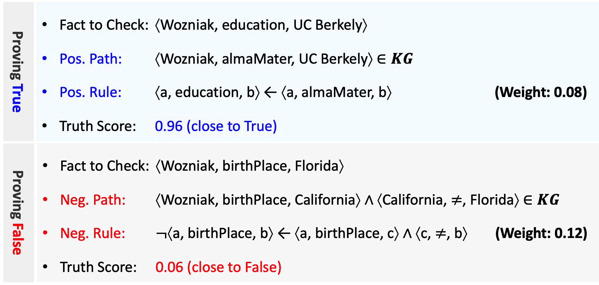

# KV-rule

## About

KV-rule is a rule-based fact checker that makes weighted logical positive and negative rules, and uses them to calculate a truth score for a given triple.

For example, the triple `(Wozniak, education, UC Berkely)` is assigned the high truth score 0.96 close to true since it is logically consistent with the triple `(Wozniak, almaMater, UC Berkely)` in a knowledge graph according to the positive rule `(x, education, y) ← (x, almaMater y)`.

In contrast, the triple `(Wozniak, birthPlace, Florida)` is assigned the low truth score 0.06 close to false since it is logically contradict to the path `(Wozniak, birthPlace, California) ∧ (California, ≠, Florida)` in a knowledge graph according to the negative rule `¬(x, birthPlace, y) ← (x, birthPlace, z) ∧ (z, ≠, y)`.



## Prerequisite
* `python 3`
* `bottle` (optional)

## How to use

### Download the pretrained positive and negative rules

**1.** Download the compressed dataset `inter.tar.bz2` ([Link](https://drive.google.com/file/d/1fv0-V-QDI5bHqQaSZapGZw-UCHS_N0O-/view?usp=sharing)).

**2.** The compressed dataset `inter.tar.bz2` contains the pre-processed knowledge graphs ([English DBpedia](https://wiki.dbpedia.org/develop/datasets/downloads-2016-10) and [K-Box](http://kbox.kaist.ac.kr)) and the pre-trained positive and negative rules.

**3.** Unzip the compressed dataset `inter.tar.bz2` by the command `tar -jxvf inter.tar.bz2`.

**4.** Locate all the contents in the unzipped dataset into the directory `inter` in the main directory of `KV-rule`.

### Calculate a truth score for a given triple

**1.** Go to the directory `code` in the main directory of `KV-rule` by the command `cd code`.

**2.** Calculate a truth score for a given triple by the following command:

```
python3 filter.py -i INPUT_FILE_PATH -o OUTPUT_DIR_PATH -cn CONFIG_FILE_PATH
```

An input file (INPUT_FILE_PATH) should contain a set of triples in the format of tab-separated-values (TSV), as follows:
```
Alanis_Morissette	nationality	Canada
Alanis_Morissette	nationality	United_Kingdom
Alanis_Morissette	nationality	Italy
Alanis_Morissette	nationality	Nigeria
Albert_Einstein	nationality	Germany
Albert_Einstein	nationality	Scotland
Albert_Einstein	nationality	Venezuela
Albert_Einstein	nationality	Iran
```

An output directory (OUTPUT_DIR_PATH) would contain the result file `result-scored.tsv` that contains a set of triples and calculated truth scores in the format of TSV, as follows:
```
Alanis_Morissette	nationality	Canada	1.0
Alanis_Morissette	nationality	United_Kingdom	0.9216958227441079
Alanis_Morissette	nationality	Italy	0.7240789450444748
Alanis_Morissette	nationality	Nigeria	0.720765944969006
Albert_Einstein	nationality	Germany	1.0
Albert_Einstein	nationality	Scotland	0.7249292427182386
Albert_Einstein	nationality	Venezuela	0.7225167109516941
Albert_Einstein	nationality	Iran	0.7180768931575049
```

If you want to calculate a truth score for an English DBpedia-style triple, set a configuration file (CONF_FILE_PATH) as `conf/conf-dben.json`. 

Or, if you want to calculate a truth score for a K-Box-style triple, set a configuration file (CONF_FILE_PATH) as `conf/conf-kbox.json`.

## Licenses
* `CC BY-NC-SA` [Attribution-NonCommercial-ShareAlike](https://creativecommons.org/licenses/by-nc-sa/2.0/)
* If you want to commercialize this resource, [please contact to us](http://mrlab.kaist.ac.kr/contact)

## Publisher
[Machine Reading Lab](http://mrlab.kaist.ac.kr/) @ KAIST

## Contact
Jiseong Kim. `jiseong@kaist.ac.kr`, `jiseongyee@gmail.com`

## Acknowledgement
This work was supported by Institute of Information & Communications Technology Planning & Evaluation(IITP) grant funded by the Korea government(MSIT) (2013-2-00109, WiseKB: Big data based self-evolving knowledge base and reasoning platform).